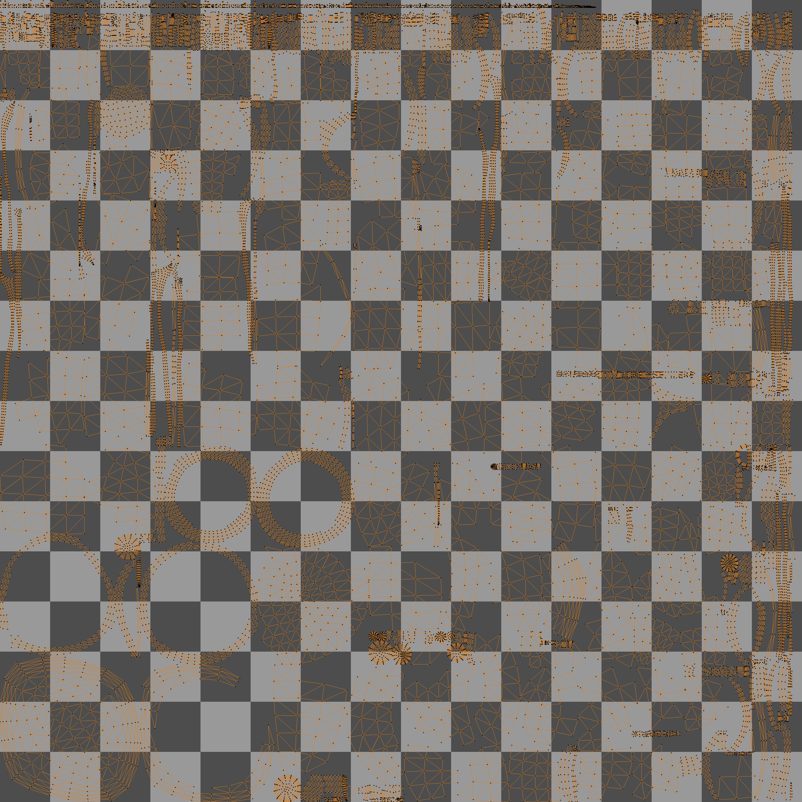
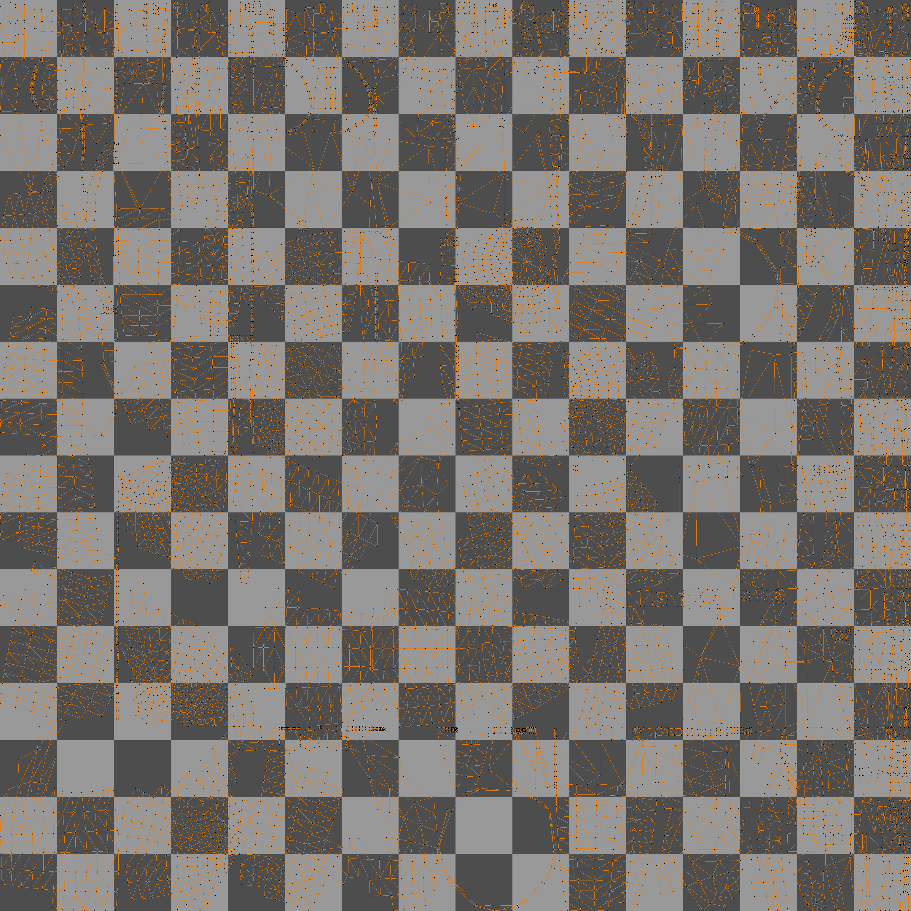
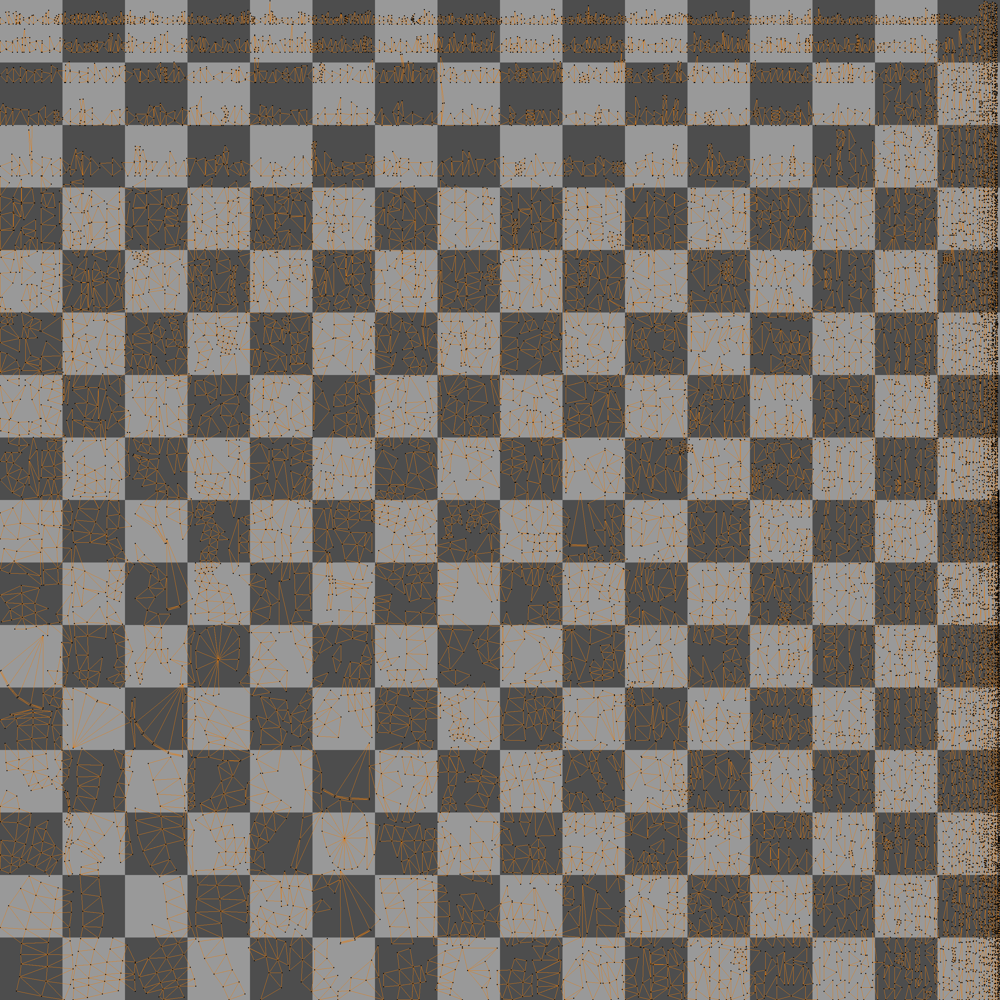
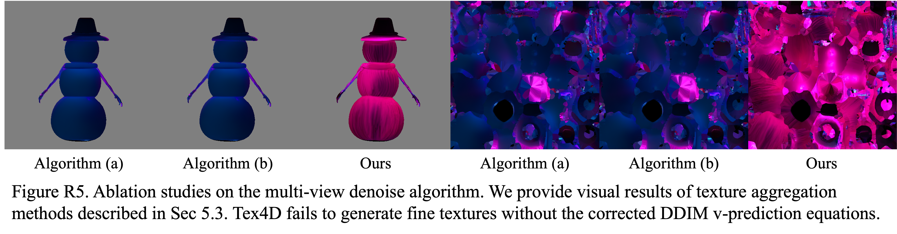

<h1 style="font-size: 24pt; text-align: center;">Tex4D: Zero-shot 4D Scene Texturing with Video Diffusion Models (Author Response)</h1>

[A. Robustness of Different UV Mappings](#a-robustness-of-different-uv-mappings)  
[B. Highly Structured Texture Generation](#b-highly-structured-texture-generation)  
[C. Long Texture Sequence Generation](#c-long-texture-sequence-generation)  
[D. Video Results of Different Keyframe Numbers and Resolutions](#d-video-results-of-different-keyframe-numbers-and-resolutions)  [E. More Ablations on Multi-view Denoise Algorithms](#e-more-ablations-on-multi-view-denoise-algorithms)  
[F. Comparison with Text-to-4D methods](#f-comparison-with-text-to-4d-methods)  
[Appendix](#appendix)

## A. Robustness of Different UV Mappings

    <button onclick="toggleImages()" style="padding: 8px 16px; cursor: pointer; background-color: #f0f0f0; border: 1px solid #ddd; border-radius: 4px;">
        Click here to view high-resolution UV islands
    </button>
    

        

            
            
            
        

    

    <video width="32%" controls loop muted playsinline>
        <source src="./static/snow_views.mp4" type="video/mp4">
    </video>
    <video width="32%" controls loop muted playsinline>
        <source src="./static/boo_views.mp4" type="video/mp4">
    </video>
    <video width="32%" controls loop muted playsinline>
        <source src="./static/mon_views.mp4" type="video/mp4">
    </video>

Video R1. Rendered results of the textures generated by Blender Smart UV with angle limit 0.5 in Fig. R1. Tex4D is robust in generating high quility textures, even with the complex UV containing lots of  islands.

## B. Highly Structured Texture Generation

## C. Long Texture Sequence Generation

    <video width="32%" controls loop muted playsinline>
        <source src="./static/100snow_views.mp4" type="video/mp4">
    </video>
    <video width="32%" controls loop muted playsinline>
        <source src="./static/200snow_views.mp4" type="video/mp4">
    </video>
    <video width="32%" controls loop muted playsinline>
        <source src="./static/300snow_views.mp4" type="video/mp4">
    </video>

Video R2. Rendered videos of scene "snowman" with long animation seqeunce (100 frames, 200 frames and 300 frames). Tex4D is robust in generating long sequence textures while preserve the dynamics. However, the texture details may degrade due to the video diffusion models distort high-frequency components in long videos <a href="#references">[1]</a>.

## D. Results of Different Keyframe Numbers and Resolutions

    <video width="40%" controls loop muted playsinline>
        <source src="./static/50snow_3_96_views.mp4" type="video/mp4">
    </video>

Video R3. Video Results with extreme less keyframes. Tex4D struggles to generate plausible textures by only selecting 3 keyframes within 50 frames.

We also provide complete video comparisons in the [Appendix](#appendix).

<!-- (3, 17), (10, 5), (17, 3) -->

## E. More Ablations on Multi-view Denoise Algorithms

## F. Comparison with Text-to-4D methods

---

### References

[1] Lu, Yu and Liang, Yuanzhi and Zhu, Linchao and Yang, Yi. FreeLong: Training-Free Long Video Generation with SpectralBlend Temporal Attention. arXiv:2407.19918.

# Appendix

   

## Video Comparisons for Sec. D

    

        <video width="100%" controls loop muted playsinline>
            <source src="./static/50snow_3_96_views.mp4" type="video/mp4">
        </video>
        
(3 keyframes, 96x96 resolution)

    

    

        <video width="100%" controls loop muted playsinline>
            <source src="./static/50snow_10_96_views.mp4" type="video/mp4">
        </video>
        
(10 keyframes, 96x96 res.)

    

    

        <video width="100%" controls loop muted playsinline>
            <source src="./static/50snow_17_96_views.mp4" type="video/mp4">
        </video>
        
(17 keyframes, 96x96 res.)

    

    

        <video width="100%" controls loop muted playsinline>
            <source src="./static/50snow_3_64_views.mp4" type="video/mp4">
        </video>
        
(3 keyframes, 64x64 res.)

    

    

        <video width="100%" controls loop muted playsinline>
            <source src="./static/50snow_10_64_views.mp4" type="video/mp4">
        </video>
        
(10 keyframes, 64x64 res.)

    

    

        <video width="100%" controls loop muted playsinline>
            <source src="./static/50snow_17_64_views.mp4" type="video/mp4">
        </video>
        
(17 keyframes, 64x64 res.)

    

Video R4. Video comparisons with different keyframe numbers and different latent resolutions. Tex4D could express more dynamics and texture details during the animation with the increasing of keyframes during the denoising period.

## Video Demo

    <video width="86%" controls loop muted playsinline>
        <source src="./static/video_teaser.mp4" type="video/mp4">
    </video>

